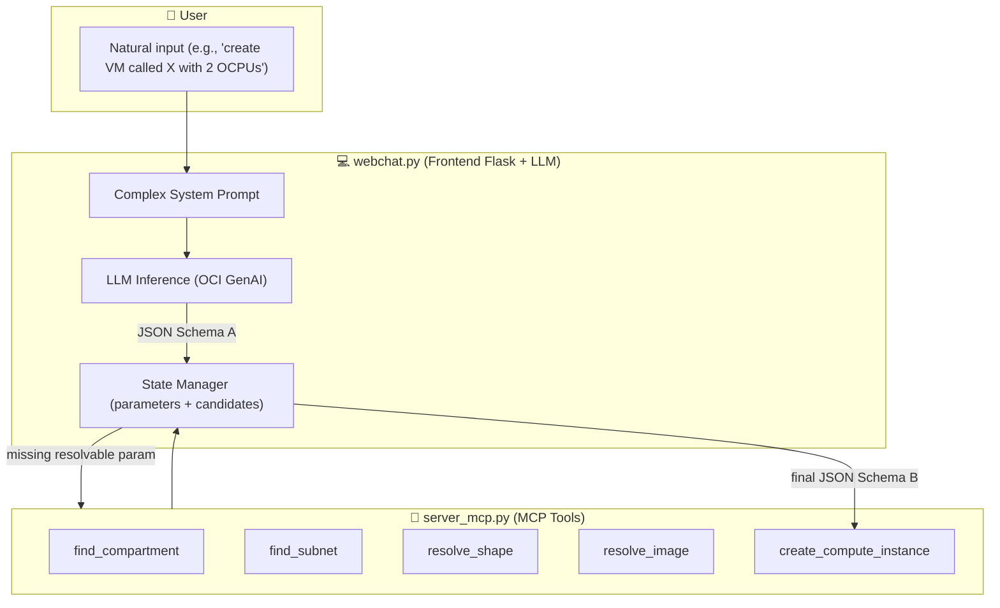

# Automate Oracle Cloud Infrastructure with Agent and MCP Server

## Introduction

This tutorial demonstrates how to build an automation layer on top of Oracle Cloud Infrastructure (OCI) that allows natural language provisioning and management of cloud resources. Instead of manually looking up OCIDs, running repetitive CLI commands, and cross-referencing documentation, a user can simply tell the system what they want in plain natual language. The agent will interpret the request, collect missing parameters, resolve human-readable names to OCIDs, and execute the necessary OCI commands automatically.

### Use Case

The primary use case is accelerating OCI operations for teams that regularly create, configure, and manage infrastructure. Common scenarios include:

- Launching compute instances with the right shape, image, and networking settings.

- Searching for compartments, subnets, and other resources without remembering exact OCIDs.

- Listing and resolving availability domains, shapes, and images.

- Running ad-hoc OCI CLI commands through a conversational interface.

- Reducing human error by validating parameters before execution.

- This automation removes the friction of navigating the OCI Console or CLI for routine tasks, making the workflow faster and less error-prone.

### Benefits

By adopting this architecture, organizations can expect:

- Reduced provisioning time — Agents can spin up infrastructure in seconds without manual lookup steps.

- Fewer configuration mistakes — Built-in checks prevent incomplete or invalid deployments.

- Improved developer productivity — Cloud engineers interact with OCI using natural language instead of memorizing CLI syntax.

- Reusability — The automation logic is encapsulated in MCP tools, making it reusable across different agent frameworks.

- Scalability — The approach supports adding new OCI operations as MCP tools without changing the core agent.

### Architecture

- Oracle Cloud Infrastructure (OCI) Generative AI: Provides the language model that understands and processes user requests.

- OCI CLI: Executes cloud operations directly, ensuring compatibility with OCI’s native tooling.

- LangChain: Handles prompt templates, message history, and LLM orchestration.

- LangGraph: Implements the ReAct pattern, enabling the agent to reason about tasks and take actions using tools.

- MCP (Multi-Server Client Protocol): Standardizes communication between the agent and external services/tools, allowing modular, maintainable automation.

- FastMCP: Lightweight MCP server implementation to expose OCI tools over the protocol.

### Patterns Adopted

- ReAct (Reason + Act): The agent alternates between reasoning steps (thinking about what to do) and action steps (calling MCP tools).

- 12-Factor App configuration: Externalized configuration for endpoints, compartments, and credentials.

- Tool modularity: Each OCI operation (e.g., find_subnet, create_compute_instance) is an independent MCP tool, making the system extensible.

- Parameter resolution flow: If a parameter is missing, the agent asks the user; if a parameter is a name, the agent automatically resolves it to an OCID.

## Pre-Requisites

- Access to an OCI tenancy to manage your cloud resources. You can register for free at oracle.com/cloud/free.

- Install Python version 3.12 or higher.

- Access to an OCI account with the OCI Generative AI service enabled.

- OCI-CLI installed (see: [Installing the CLI](https://docs.oracle.com/en-us/iaas/Content/API/SDKDocs/cliinstall.htm))

- Install and configure the Python Langchain library.

- Access to the cohere.command-r-08-2024 model using OCI Generative AI.

- Install auxiliary libraries:

  - oracledb
  - sentence_transformers
  - numpy
  - mcp-server-fastmcp
  - asyncio
  - langchain_core
  - langchain_community
  - mcp
  - langgraph
  - langchain_mcp_adapters

Download and install the [requirements.txt](./files/requirements.txt) file using pip install -r requirements.txt command.

    pip install -r requirements.txt

## 🚀 Concepts

### Multi-Agent Communication Protocol (MCP)
MCP provides a standardized way to expose tools (functions) from a backend server to AI agents.  
In this demo:
- **`server_mcp.py`** → Exposes OCI-related tools (`find_compartment`, `resolve_image`, `resolve_shape`, etc.).
- **`webchat.py`** → Provides a webchat interface where the user interacts with the agent.

### Parameter Resolution
Parameters are divided into two categories:

- **Literal parameters** (extracted directly from user request):  
  - `display_name`, `ocpus`, `memoryInGBs`
- **Resolvable parameters** (require lookup via MCP tools):  
  - `compartment_id`, `subnet_id`, `availability_domain`, `image_id`, `shape`

The pipeline follows **Schema A → Schema B** flow:
1. Schema A: partial resolution, with `candidates` or `ask` fields if ambiguity exists.
2. Schema B: final payload, ready for compute instance creation.

---

## 📂 Project Structure

```
.
├── README.md                        # Documentation (this file)
└── files/
    ├── webchat.py                   # Flask webchat app connected to MCP server
    ├── server_mcp.py                # MCP server exposing OCI tools
    └── templates/
        └── chat.html                # Web UI template used by webchat.py (Flask)

```

---

## 🛠️ Key Components

### 1. `server_mcp.py`
This script exposes MCP tools for resolving OCI resources. Example tools:
- `find_compartment` → Locate compartments by name.
- `find_subnet` → Locate subnets within a compartment.
- `list_availability_domains` / `find_ad` → Resolve availability domains.
- `resolve_image` → Find images (e.g., Oracle Linux 9).
- `resolve_shape` → Match compute shapes (e.g., `VM.Standard.E4.Flex`).
- `create_compute_instance` → Launches a VM using OCI CLI.

Each tool returns structured JSON with either:
- A **single match** (directly placed in parameters)
- **Multiple matches** (returned in `candidates` for user choice)
- **No matches** (returned as an `ask` prompt)

> 🔑 **Design principle:** literal parameters (name, OCPUs, memory) are never candidates.

---

### 2. `webchat.py`
The webchat provides a conversational interface.  
It integrates:
- **Prompt Design** (instructions for literal/resolvable params, candidates, asks)
- **Flask server** to handle user requests and responses
- **Async MCP client** to call tools exposed in `server_mcp.py`

It enforces the **Schema A / Schema B contract**:
- Schema A (when resolution is incomplete):
```json
{
  "parameters": {
    "compartment_id": null,
    "subnet_id": null,
    "availability_domain": null,
    "image_id": null,
    "shape": null,
    "ocpus": 2,
    "memoryInGBs": 16,
    "display_name": "test_vm"
  },
  "candidates": {
    "image_id": [
      { "index": 1, "name": "Oracle-Linux-9.6-2025.09.16-0", "ocid": "ocid1.image....", "version": "2025.09.16", "score": 0.98 }
    ]
  },
  "ask": "Which image do you want to use?"
}
```
- Schema B (final payload for creation):
```json
{
  "compartmentId": "ocid1.compartment...",
  "subnetId": "ocid1.subnet...",
  "availabilityDomain": "IAfA:SA-SAOPAULO-1-AD-1",
  "imageId": "ocid1.image...",
  "displayName": "test_vm",
  "shape": "VM.Standard.E4.Flex",
  "shapeConfig": { "ocpus": 2, "memoryInGBs": 16 }
}
```

---

## 🔎 Code Walkthrough

## Overall Architecture

The system consists of two main modules:

- **`server_mcp.py`**: MCP server that exposes tools to resolve OCI parameters (e.g., `find_compartment`, `resolve_image`, `resolve_shape`).
- **`webchat.py`**: Flask-based frontend that receives user natural input, builds the **complex prompt** for the LLM, manages parameter state, and calls MCP tools when required.

### Operation Flow



---

## webchat.py — Key Highlights

### 1. **Prompt**

The `system_text` defines a strict **multi-step pipeline** for the LLM.  
It ensures consistent behavior and prevents hallucination:

- **Step 1 (Extraction)** → Extract all literal values from user input (name, OCPUs, memory, etc).
- **Step 2 (Classification)** → Separate **literal parameters** (fixed) from **resolvable ones** (require OCID lookup).
- **Step 3 (Resolution)** → Call MCP tools to resolve resolvable parameters. Generate candidates if ambiguous.
- **Step 4 (Assembly)** → Return Schema A (partial, with candidates/ask) or Schema B (final, ready to create).

👉 **Why so detailed?**  
Because LLMs tend to **invent keys or mix formats**. This prompt enforces:
- Literals never become candidates.
- Resolvables always have fallback (candidates or ask).
- Final output is deterministic: Schema A or Schema B.

---

### 2. **State Management**

```python
if "parameters" not in memory:
    memory["parameters"] = {
        "compartment_id": None,
        "subnet_id": None,
        "availability_domain": None,
        "image_id": None,
        "shape": None,
        "ocpus": None,
        "memoryInGBs": None,
        "display_name": None
    }
```

- Keeps track of partially resolved parameters.
- Supports **multi-turn conversations** (user can refine parameters incrementally).
- Prevents context loss between steps.

---

### 3. **MCP Tool Integration**

When the LLM detects a resolvable parameter, `webchat.py` does not fabricate OCIDs.  
Instead, it calls `server_mcp.py` tools:

```python
tools = asyncio.get_event_loop().run_until_complete(load_tools())
```

Returned candidates always contain **real OCIDs** from OCI:

```json
{
  "candidates": {
    "image_id": [
      { "index": 1, "name": "Oracle-Linux-9.6-2025.09.16-0", "ocid": "ocid1.image.oc1..aaaa...", "version": "2025.09.16", "score": 0.98 }
    ]
  }
}
```

---

### 4. **Schema A vs Schema B**

- **Schema A (resolving phase)**
  ```json
  {
    "parameters": { "shape": null, "image_id": null, "display_name": "vm01" },
    "candidates": { "shape": [...], "image_id": [...] },
    "ask": "Please select a shape"
  }
  ```

- **Schema B (final, ready to create)**
  ```json
  {
    "compartmentId": "...",
    "subnetId": "...",
    "availabilityDomain": "...",
    "imageId": "...",
    "displayName": "vm01",
    "shape": "VM.Standard.E4.Flex",
    "shapeConfig": { "ocpus": 2, "memoryInGBs": 16 }
  }
  ```

👉 Ensures that **creation is only triggered when all parameters are fully resolved**.

---

📌 **Summary:**
- `server_mcp.py` = tool provider.
- `webchat.py` = orchestrator with complex prompt, state, and LLM integration.
- Prompt enforces deterministic JSON outputs.
- Architecture supports **multi-turn resolution** with candidates and safe fallback.


### `server_mcp.py`
```python
@mcp.tool()
async def resolve_shape(hint: str, compartment_ocid: Optional[str] = None, ad: Optional[str] = None) -> Dict[str, Any]:
    """Resolve a shape by hint like 'e4' → best match 'VM.Standard.E4.Flex'."""
    lst = await list_shapes(compartment_ocid=compartment_ocid, ad=ad)
    if lst.get("status") != "ok":
        return lst
    items = lst["data"]
    q = _normalize(hint)
    scored = []
    for s in items:
        name = s.get("shape") or ""
        s1 = similarity(q, name)
        # bonus if hint matches family prefix
        fam = _normalize(name.replace("VM.Standard.", ""))
        s1 += 0.2 if fam.startswith(q) or q in fam else 0
        scored.append((s1, name))
    scored.sort(reverse=True, key=lambda x: x[0])
    if not scored:
        return {"status": "not_found", "candidates": []}
    best = scored[0]
    return {"status": "ok" if best[0] >= 0.6 else "ambiguous", "shape": best[1], "candidates": [n for _, n in scored[:5]]}
```
🔹 This function uses similarity scoring to match user input with available shapes.  
🔹 Returns either the best match or a candidate list.

---

### `create_compute_instance`
```python
@mcp.tool()
async def create_compute_instance(
        compartment_ocid: Optional[str] = None,
        subnet_ocid: Optional[str] = None,
        availability_domain: Optional[str] = None,
        shape: Optional[str] = None,
        ocpus: Optional[int] = None,
        memory: Optional[int] = None,
        image_ocid: Optional[str] = None,
        display_name: Optional[str] = None,
        ssh_authorized_keys_path: Optional[str] = None,
        extra_args: Optional[List[str]] = None,
) -> Dict[str, Any]:
    args = [
        "compute", "instance", "launch",
        "--compartment-id", compartment_ocid or "",
        "--subnet-id", subnet_ocid or "",
        "--shape", shape or "",
        "--shape-config", json.dumps({"ocpus": ocpus, "memoryInGBs": memory}),
        "--availability-domain", availability_domain or "",
        "--image-id", image_ocid or "",
    ]
    if display_name:
        args += ["--display-name", display_name]
    if ssh_authorized_keys_path:
        args += ["--metadata", json.dumps({"ssh_authorized_keys": open(ssh_authorized_keys_path, "r").read()})]
    if extra_args:
        args += extra_args

    code, out, err = oci_cli.run(args)
    if code != 0:
        return {"status": "error", "error": err.strip(), "stdout": out}
    try:
        payload = json.loads(out)
    except Exception:
        payload = {"raw": out}
    return {"status": "ok", "oci_result": payload}
```
🔹 Wraps OCI CLI to launch an instance.  
🔹 Ensures `ocpus` and `memoryInGBs` are packaged under `--shape-config`.  
🔹 Returns full OCI CLI result or error details.

---

## ▶️ How to Run

1. Start the MCP server (ONLY IF YOU NEED TO INTEGRATE WITH OTHER PROCESSES):
>**Note:** Just execute the server if you want to integrate with other processes. In this tutorial, you don't need to execute it. The webchat.py call the server_mcp.py remotely.
```bash
python server_mcp.py
```

2. Start the webchat UI:
```bash
python webchat.py --device=cuda
```

3. Open in browser:
```
http://localhost:8080
```

---

## 💡 Example Usage

- **Create VM**:
```
create a VM called test_hoshikawa in compartment cristiano.hoshikawa, 
availability domain SA-SAOPAULO-1-AD-1, 
subnet "public subnet-vcn" in compartment xpto, 
shape VM.Standard.E4.Flex, 
image Oracle Linux 9, 
with 2 OCPUs and 16 GB memory
```

Agent response (Schema A or B depending on resolution).

---

## 🐞 Troubleshooting

- **Error: too many tokens** → Simplify input request, avoid unnecessary repetition.  
- **Missing shapeConfig** → Ensure both `ocpus` and `memoryInGBs` are extracted and passed.  
- **Authorization errors** → Validate your OCI CLI config and IAM permissions.  

---

## 📜 License
MIT License
