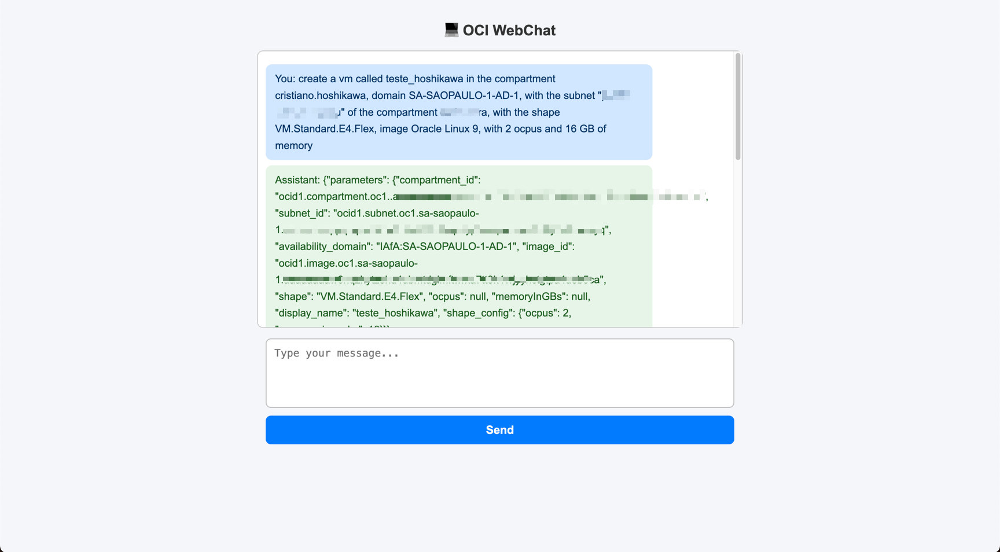

# Automate Oracle Cloud Infrastructure with Agent and MCP Server

## Introduction

This tutorial demonstrates how to build an automation layer on top of Oracle Cloud Infrastructure (OCI) that allows natural language provisioning and management of cloud resources. Instead of manually looking up OCIDs, running repetitive CLI commands, and cross-referencing documentation, a user can simply tell the system what they want in plain natual language. The agent will interpret the request, collect missing parameters, resolve human-readable names to OCIDs, and execute the necessary OCI commands automatically.

### Use Case

The primary use case is accelerating OCI operations for teams that regularly create, configure, and manage infrastructure. Common scenarios include:

- Launching compute instances with the right shape, image, and networking settings.

- Searching for compartments, subnets, and other resources without remembering exact OCIDs.

- Listing and resolving availability domains, shapes, and images.

- Running ad-hoc OCI CLI commands through a conversational interface.

- Reducing human error by validating parameters before execution.

- This automation removes the friction of navigating the OCI Console or CLI for routine tasks, making the workflow faster and less error-prone.

### Benefits

By adopting this architecture, organizations can expect:

- Reduced provisioning time — Agents can spin up infrastructure in seconds without manual lookup steps.

- Fewer configuration mistakes — Built-in checks prevent incomplete or invalid deployments.

- Improved developer productivity — Cloud engineers interact with OCI using natural language instead of memorizing CLI syntax.

- Reusability — The automation logic is encapsulated in MCP tools, making it reusable across different agent frameworks.

- Scalability — The approach supports adding new OCI operations as MCP tools without changing the core agent.

### Architecture

- Oracle Cloud Infrastructure (OCI) Generative AI: Provides the language model that understands and processes user requests.

- OCI CLI: Executes cloud operations directly, ensuring compatibility with OCI’s native tooling.

- LangChain: Handles prompt templates, message history, and LLM orchestration.

- LangGraph: Implements the ReAct pattern, enabling the agent to reason about tasks and take actions using tools.

- MCP (Multi-Server Client Protocol): Standardizes communication between the agent and external services/tools, allowing modular, maintainable automation.

- FastMCP: Lightweight MCP server implementation to expose OCI tools over the protocol.

### Patterns Adopted

- ReAct (Reason + Act): The agent alternates between reasoning steps (thinking about what to do) and action steps (calling MCP tools).

- 12-Factor App configuration: Externalized configuration for endpoints, compartments, and credentials.

- Tool modularity: Each OCI operation (e.g., find_subnet, create_compute_instance) is an independent MCP tool, making the system extensible.

- Parameter resolution flow: If a parameter is missing, the agent asks the user; if a parameter is a name, the agent automatically resolves it to an OCID.

## Pre-Requisites

- Access to an OCI tenancy to manage your cloud resources. You can register for free at oracle.com/cloud/free.

- Install Python version 3.12 or higher.

- Access to an OCI account with the OCI Generative AI service enabled.

- Install and configure the Python Langchain library.

- Access to the cohere.command-r-08-2024 model using OCI Generative AI.

- Install auxiliary libraries:

  - oracledb
  - sentence_transformers
  - numpy
  - mcp-server-fastmcp
  - asyncio
  - langchain_core
  - langchain_community
  - mcp
  - langgraph
  - langchain_mcp_adapters

Download and install the [requirements.txt](./files/requirements.txt) file using pip install -r requirements.txt command.

    pip install -r requirements.txt

## Understand the Code

You can download the source code here:

- [agent_over_mcp.py](./files/agent_over_mcp.py)
- [server_mcp.py](./files/server_mcp.py)
- [requirements.txt](./files/requirements.txt)
- [config file](./files/config)


### Agent code

This script builds an OCI Operations Agent using LangChain, LangGraph, and the MCP protocol.
It connects to an MCP server that exposes tools for managing OCI resources and uses an Oracle Cloud Generative AI model to interact in natural language.
The agent follows the ReAct pattern (Reason + Act) to alternate between reasoning and tool usage.

It imports the required libraries.

Standard Python modules for system interaction, file I/O, JSON parsing, and asynchronous execution.

LangChain for prompt and message abstractions.

The OCI Generative AI wrapper for LangChain to connect to Oracle-hosted LLMs.

LangGraph’s prebuilt ReAct agent builder.

The MCP client adapter to connect and fetch tool definitions from MCP servers.

```python
import sys
import os
import json
import asyncio

from langchain_core.prompts import ChatPromptTemplate
from langchain_community.chat_models.oci_generative_ai import ChatOCIGenAI
from langgraph.prebuilt import create_react_agent
from langchain_core.messages import HumanMessage, AIMessage
from langchain_mcp_adapters.client import MultiServerMCPClient

```

It loads external configuration from ./config to avoid hardcoding environment-specific values.
This file contains endpoint URLs, OCI compartment ID, profile name, and CLI paths.

```python
# Configuration File
with open("./config", "r") as f:
    config_data = json.load(f)

```

It defines a minimal in-memory state to hold the conversation history.
This will store all HumanMessage and AIMessage objects exchanged during the chat session.

```python
# Memory Management for the OCI Resource Parameters
class MemoryState:
    def __init__(self):
        self.messages = []

```

It creates a LangChain chat model for OCI Generative AI.
The model is cohere.command-r-08-2024, configured with a low temperature for deterministic output and a maximum token limit for responses.

```python
# Define the language model
llm = ChatOCIGenAI(
    model_id="cohere.command-r-08-2024",
    service_endpoint=config_data["llm_endpoint"],
    compartment_id=config_data["compartment_id"],
    auth_profile=config_data["oci_profile"],
    model_kwargs={"temperature": 0.1, "top_p": 0.75, "max_tokens": 2000}
)

```

It builds the system prompt for the agent.
The prompt sets the role, defines interaction and operational rules, and specifies output formatting guidelines.
It includes a {messages} placeholder for injecting chat history dynamically.

```python
# Prompt
prompt = ChatPromptTemplate.from_messages([
    ("system", """
        You are an OCI Operations Agent with access to MCP tools (server `oci-ops`).
        Your goal is to provision and manage OCI resources **without requiring the user to know OCIDs**.
                
        INTERACTION RULES:
        1) Wait until the user ask to create a resource
        2) If all the parameters has the ocid information, create the resource
        3) If all the parameters were filled by the user, create the resource
        4) If a parameter given is a name and needs to be converted to a OCID, search for it automatically
        5) If a parameter is missing, ask for the information
        6) Do not wait for a response from creation. Inform "Creation of resource is Done."
        
        IMPORTANT RULES:
        1) Never invent OCIDs. Prefer to ask succinct follow-ups.
        2) Prefer to reuse defaults from memory when appropriate
        
        OUTPUT STYLE:
        - Questions: short, one parameter at a time.
        - Show: mini-summary with final values.
        - Candidate lists: numbered, with name (type) — ocid — score when available.
    """),
    ("placeholder", "{messages}")
])

```

It defines the asynchronous main() function.
This function:

Creates an MCP client configured to run server_mcp.py for the oci-ops server using stdio transport.

Sets environment variables for the OCI CLI.

```python
async def main():
    client = MultiServerMCPClient(
        {
            "oci-ops": {
                "command": sys.executable,
                "args": ["server_mcp.py"],
                "transport": "stdio",
                "env": {
                    "PATH": os.environ.get("PATH", "") + os.pathsep + os.path.expanduser("~/.local/bin"),
                    "OCI_CLI_BIN": config_data["OCI_CLI_BIN"],
                    "OCI_CLI_PROFILE": config_data["oci_profile"],
                },
            },
        }
    )

```

It retrieves the available tools from the MCP server.
If no tools are found, the function exits; otherwise, it prints the tool names.

```python
    tools = await client.get_tools()
    if not tools:
        print("❌ No MCP tools were loaded. Please check if the server is running.")
        return

    print("🛠️ Loaded tools:", [t.name for t in tools])

```

It initializes the memory state and creates the ReAct agent with LangGraph, using the LLM, tools, and prompt defined earlier.

```python
    # Creating the LangGraph agent with in-memory state
    memory_state = MemoryState()
    memory_state.messages = []

    agent_executor = create_react_agent(
        model=llm,
        tools=tools,
        prompt=prompt,
    )

```

It starts an interactive conversation loop.
Each user input is appended to memory, sent to the agent, and the agent’s reply is displayed.
The loop ends when the user types quit or exit.

```python
    print("🤖 READY")
    while True:
        query = input("You: ")
        if query.lower() in ["quit", "exit"]:
            break
        if not query.strip():
            continue

        memory_state.messages.append(HumanMessage(content=query))
        try:
            result = await agent_executor.ainvoke({"messages": memory_state.messages})
            new_messages = result.get("messages", [])

            # Store new messages
            memory_state.messages.extend(new_messages)

            print("Assist:", new_messages[-1].content)

            formatted_messages = prompt.format_messages()

        except Exception as e:
            print("Error:", e)

```

It runs the asynchronous main() function when the script is executed directly.

```python
# Run the agent with asyncio
if __name__ == "__main__":
    asyncio.run(main())

```

### MCP Server

This script implements an MCP (Multi-Server Client Protocol) server using FastMCP for Oracle Cloud Infrastructure (OCI).
It exposes several MCP tools to find and resolve OCI resources and to create compute instances using the oci CLI.
It also includes helper functions for logging, parsing OCI config, normalizing and comparing strings, and running CLI commands.

It starts by importing all required libraries.
These include standard Python modules for system commands, text normalization, config parsing, JSON, and subprocess execution, plus the FastMCP server class from the mcp.server.fastmcp package.

```python
import re
import shlex
import subprocess
import unicodedata
from typing import Any, Dict, List, Optional, Tuple
import os
import json
import configparser
from mcp.server.fastmcp import FastMCP

```

It loads a config file containing runtime parameters such as the OCI CLI binary path and the OCI CLI profile name.

```python
# Config File
with open("./config", "r") as f:
    config_data = json.load(f)

```

It initializes a FastMCP server instance named oci-ops.
This name is how clients (like the LangChain agent) will refer to this MCP server.

```python
# FastMCP Server
mcp = FastMCP("oci-ops")

```

It defines a helper function to append command lines and outputs to a log file (log.txt).
This is used throughout the script to keep a record of all oci commands executed and their results.

```python
def append_line(file_path: str, base: list):
    """
    Save the sequence of commands in `base` to a text file.

    Args:
        file_path (str): Path to the text file.
        base (list): List of command parts to save.
    """
    with open(file_path, "a", encoding="utf-8") as f:
        command_line = " ".join(map(str, base))
        f.write(command_line + "\n")
        f.flush()

```

It declares a wrapper class OCI to run oci CLI commands with the configured profile and binary path.
The run() method logs the command, executes it, logs stdout and stderr, and returns the result.

```python
class OCI:
    def __init__(self, profile: Optional[str] = None, bin_path: Optional[str] = None):
        self.profile = config_data["oci_profile"]
        self.bin = config_data["OCI_CLI_BIN"]

    def run(self, args: List[str]) -> Tuple[int, str, str]:
        try:
            base = [self.bin]
            if self.profile:
                base += ["--profile", self.profile]
            cmd = base + args
            append_line("log.txt", cmd)
            proc = subprocess.run(cmd, stdout=subprocess.PIPE, stderr=subprocess.PIPE, text=True)
            append_line("log.txt", proc.stdout)
            append_line("log.txt", proc.stderr)
            append_line("log.txt", "--------------------------")
            return proc.returncode, proc.stdout, proc.stderr
        except ex as Exception:
            append_line("log.txt", str(ex))

oci_cli = OCI(profile=config_data["oci_profile"])

```

It defines helpers to read the OCI config file, get the tenancy OCID, and safely parse JSON from strings.
These are used by the MCP tools to supply default values and parse command results.

```python
def _read_oci_config(profile: Optional[str]) -> Dict[str, str]:
    cfg_path = os.path.expanduser("~/.oci/config")
    cp = configparser.ConfigParser()
    if os.path.exists(cfg_path):
        cp.read(cfg_path)
        prof = config_data["oci_profile"]
        if cp.has_section(prof):
            return {k: v for k, v in cp.items(prof)}
    return {}

def _tenancy_ocid() -> Optional[str]:
    return _read_oci_config(config_data["oci_profile"]).get("tenancy")

def _safe_json(s: str) -> Any:
    try:
        return json.loads(s)
    except Exception:
        return {"raw": s}

```

It implements phonetic and fuzzy matching helpers for Brazilian Portuguese (pt-BR).
These are used to match names that are similar in spelling or sound (e.g., when the user provides a partial resource name).

```python
_consonant_map = {
    "b": "1", "f": "1", "p": "1", "v": "1",
    "c": "2", "g": "2", "j": "2", "k": "2", "q": "2", "s": "2", "x": "2", "z": "2",
    "d": "3", "t": "3",
    "l": "4",
    "m": "5", "n": "5",
    "r": "6",
}

def _normalize(text: str) -> str:
    text = unicodedata.normalize("NFKD", text)
    text = "".join(ch for ch in text if not unicodedata.combining(ch))
    text = re.sub(r"[^a-zA-Z0-9 ]+", " ", text)
    return re.sub(r"\s+", " ", text).strip().lower()

def ptbr_soundex(word: str, maxlen: int = 6) -> str:
    w = _normalize(word)
    if not w:
        return ""
    first_letter = w[0]
    digits = []
    prev = ""
    for ch in w[1:]:
        if ch in "aeiouhwy ":
            code = ""
        else:
            code = _consonant_map.get(ch, "")
        if code and code != prev:
            digits.append(code)
        prev = code
    code = (first_letter + "".join(digits))[:maxlen]
    return code.ljust(maxlen, "0")

from difflib import SequenceMatcher

def similarity(a: str, b: str) -> float:
    return SequenceMatcher(None, _normalize(a), _normalize(b)).ratio()

```

It declares MCP tools using the @mcp.tool() decorator.
Each function implements a specific OCI operation or search, using the oci_cli.run() helper.


```python
# ------------------------------
# MCP Tools
# ------------------------------
@mcp.tool()
async def find_subnet(query_text: str) -> dict:
    """
    Find the subnet ocid by the name and the compartment ocid
    """
    structured = f"query subnet resources where displayName =~ '.*{query_text}*.'"
    code, out, err = oci_cli.run(["search","resource","structured-search","--query-text", structured])
    if code != 0:
        return {"status":"error","stderr": err, "stdout": out}
    data = json.loads(out)
    items = data.get("data",{}).get("items",[])
    return {"status":"ok","data": items}

@mcp.tool()
async def list_availability_domains(compartment_ocid: Optional[str] = None) -> Dict[str, Any]:
    """List ADs with `oci iam availability-domain list`."""
    cid = compartment_ocid or _tenancy_ocid()
    if not cid:
        return {"status": "error", "error": "Missing tenancy compartment OCID."}
    code, out, err = oci_cli.run(["iam", "availability-domain", "list", "--compartment-id", cid])
    if code != 0:
        return {"status": "error", "stderr": err, "stdout": out}
    return {"status": "ok", "data": _safe_json(out)}

@mcp.tool()
async def find_ad(name_or_hint: str, compartment_ocid: Optional[str] = None) -> Dict[str, Any]:
    """Find the AD by a name (ex.: 'SAOPAULO-1-AD-1')."""
    lst = await list_availability_domains(compartment_ocid)
    if lst.get("status") != "ok":
        return lst
    items = lst["data"].get("data", []) if isinstance(lst["data"], dict) else []
    q = _normalize(name_or_hint)
    scored = []
    for ad in items:
        adname = ad.get("name") or ad.get("display-name") or ""
        s = similarity(q, adname)
        scored.append((s, adname))
    scored.sort(reverse=True, key=lambda x: x[0])
    if not scored:
        return {"status": "not_found", "candidates": []}
    best = scored[0]
    return {"status": "ok" if best[0] >= 0.6 else "ambiguous", "ad": scored[0][1], "candidates": [n for _, n in scored[:5]]}

async def list_shapes(compartment_ocid: Optional[str] = None, ad: Optional[str] = None) -> Dict[str, Any]:
    """List the shapes with `oci compute shape list --all` (needs compartment; AD is optional)."""
    cid = compartment_ocid or _tenancy_ocid()
    if not cid:
        return {"status": "error", "error": "Missing compartment OCID."}
    args = ["compute", "shape", "list", "--compartment-id", cid, "--all"]
    if ad:
        args += ["--availability-domain", ad]
    code, out, err = oci_cli.run(args)
    if code != 0:
        return {"status": "error", "stderr": err, "stdout": out}
    data = _safe_json(out)
    return {"status": "ok", "data": data.get("data", []) if isinstance(data, dict) else data}

@mcp.tool()
async def resolve_shape(hint: str, compartment_ocid: Optional[str] = None, ad: Optional[str] = None) -> Dict[str, Any]:
    """Resolve shape informing a name 'e4' → find all shapes have e4 like 'VM.Standard.E4.Flex'."""
    lst = await list_shapes(compartment_ocid=compartment_ocid, ad=ad)
    if lst.get("status") != "ok":
        return lst
    items = lst["data"]
    q = _normalize(hint)
    scored = []
    for s in items:
        name = s.get("shape") or ""
        s1 = similarity(q, name)
        # bônus para begins-with no sufixo da família
        fam = _normalize(name.replace("VM.Standard.", ""))
        s1 += 0.2 if fam.startswith(q) or q in fam else 0
        scored.append((s1, name))
    scored.sort(reverse=True, key=lambda x: x[0])
    if not scored:
        return {"status": "not_found", "candidates": []}
    best = scored[0]
    return {"status": "ok" if best[0] >= 0.6 else "ambiguous", "shape": best[1], "candidates": [n for _, n in scored[:5]]}

async def list_images(compartment_ocid: Optional[str] = None,
                      operating_system: Optional[str] = None,
                      operating_system_version: Optional[str] = None,
                      shape: Optional[str] = None) -> Dict[str, Any]:
    """Find the image by a short name or similarity"""
    cid = compartment_ocid or _tenancy_ocid()
    if not cid:
        return {"status": "error", "error": "Missing compartment OCID."}
    args = ["compute", "image", "list", "--compartment-id", cid, "--all"]
    if operating_system:
        args += ["--operating-system", operating_system]
    if operating_system_version:
        args += ["--operating-system-version", operating_system_version]
    if shape:
        args += ["--shape", shape]
    code, out, err = oci_cli.run(args)
    if code != 0:
        return {"status": "error", "stderr": err, "stdout": out}
    data = _safe_json(out)
    items = data.get("data", []) if isinstance(data, dict) else []
    return {"status": "ok", "data": items}

@mcp.tool()
async def resolve_image(query: str,
                        compartment_ocid: Optional[str] = None,
                        shape: Optional[str] = None) -> Dict[str, Any]:
    """Find the image by a short name or similarity"""
    # heuristic
    q = query.strip()
    os_name, os_ver = None, None
    # examples: "Oracle Linux 9", "OracleLinux 9", "OL9"
    if "linux" in q.lower():
        os_name = "Oracle Linux"
        m = re.search(r"(?:^|\\D)(\\d{1,2})(?:\\D|$)", q)
        if m:
            os_ver = m.group(1)

    # Filter for version
    lst = await list_images(compartment_ocid=compartment_ocid, operating_system=os_name, operating_system_version=os_ver)
    if lst.get("status") != "ok":
        return lst
    items = lst["data"]
    if not items:
        # fallback: sem filtro, listar tudo e fazer fuzzy no display-name
        lst = await list_images(compartment_ocid=compartment_ocid)
        if lst.get("status") != "ok":
            return lst
        items = lst["data"]

    # ranking for display-name and creation date
    ranked = []
    for img in items:
        dn = img.get("display-name","")
        s = similarity(query, dn)
        ts = img.get("time-created") or img.get("time_created") or ""
        ranked.append((s, ts, img))
    ranked.sort(key=lambda x: (x[0], x[1]), reverse=True)

    if not ranked:
        return {"status": "not_found", "candidates": []}

    best = ranked[0][2]
    # top-5 candidates
    cands = []
    for s, _, img in ranked[:5]:
        cands.append({"name": img.get("display-name"), "ocid": img["id"], "score": round(float(s), 4)})

    status = "ok" if cands and cands[0]["score"] >= 0.65 else "ambiguous"
    return {"status": status, "resource": cands[0] if cands else None, "candidates": cands}

def _norm(s: str) -> str:
    return _normalize(s)

@mcp.tool()
async def find_compartment(query_text: str) -> dict:
    """
    Find compartment ocid by the name
    """
    structured = f"query compartment resources where displayName =~ '.*{query_text}*.'"
    code, out, err = oci_cli.run(["search","resource","structured-search","--query-text", structured])
    if code != 0:
        return {"status":"error","stderr": err, "stdout": out}
    data = json.loads(out)
    items = data.get("data",{}).get("items",[])
    return {"status":"ok","data": items}

@mcp.tool()
async def create_compute_instance(
        compartment_ocid: Optional[str] = None,
        subnet_ocid: Optional[str] = None,
        availability_domain: Optional[str] = None,
        shape: Optional[str] = None,
        ocpus: Optional[int] = None,       # Inteiro opcional
        memory: Optional[int] = None,      # Inteiro opcional
        image_ocid: Optional[str] = None,
        display_name: Optional[str] = None,
        ssh_authorized_keys_path: Optional[str] = None,
        extra_args: Optional[List[str]] = None,
) -> Dict[str, Any]:
    """Create an OCI Compute instance via `oci` CLI. Missing parameters should be asked upstream by the agent.
    ## Example of expected parameters to create a compute instance: ##
    compartment-id: ocid1.compartment.oc1..aaaaaaaaaaaaaaaaaaaaaaaaaaaaaaaaaaaaaaaaaaaaaaaaaaaaaaaaaaaa
    subnet-id: ocid1.subnet.oc1.sa-saopaulo-1.aaaaaaaaaaaaaaaaaaaaaaaaaaaaaaaaaaaaaaaaaaaaaaaaaaaaaaaaaaaa
    shape: VM.Standard.E4.Flex
    availability-domain: IAfA:SA-SAOPAULO-1-AD-1
    image-id: ocid1.image.oc1.sa-saopaulo-1.aaaaaaaaaaaaaaaaaaaaaaaaaaaaaaaaaaaaaaaaaaaaaaaaaaaaaaaaaaaaaaaa
    display-name: teste_hoshikawa
    shape-config: '{"ocpus": 2, "memoryInGBs": 16}'
    """
    args = [
        "compute", "instance", "launch",
        "--compartment-id", compartment_ocid or "",
        "--subnet-id", subnet_ocid or "",
        "--shape", shape or "",
        "--shape-config", json.dumps({"ocpus": ocpus, "memoryInGBs": memory}),
        "--availability-domain", availability_domain or "",
        "--image-id", image_ocid or "",
        #"--source-details", json.dumps({"sourceType": "image", "imageId": image_ocid or ""}),
    ]
    if display_name:
        args += ["--display-name", display_name]
    if ssh_authorized_keys_path:
        args += ["--metadata", json.dumps({"ssh_authorized_keys": open(ssh_authorized_keys_path, "r", encoding="utf-8").read()})]
    if extra_args:
        args += extra_args

    # validate basics
    for flag in ["--compartment-id", "--subnet-id", "--shape", "--availability-domain"]:
        if "" in [args[args.index(flag)+1]]:
            return {"status": "error", "error": f"Missing required {flag} value"}

    code, out, err = oci_cli.run(args)
    if code != 0:
        return {"status": "error", "error": err.strip(), "stdout": out}
    try:
        payload = json.loads(out)
    except Exception:
        payload = {"raw": out}
    return {"status": "ok", "oci_result": payload}

@mcp.tool()
async def oci_cli_passthrough(raw: str) -> Dict[str, Any]:
    """Run an arbitrary `oci` CLI command (single string). Example: "network vcn list --compartment-id ocid1..."""
    args = shlex.split(raw)
    code, out, err = oci_cli.run(args)
    result = {"returncode": code, "stdout": out, "stderr": err}
    # try JSON parse
    try:
        result["json"] = json.loads(out)
    except Exception:
        pass
    return result
```

Finally, it includes the script’s entrypoint.
When run directly, the MCP server starts with stdio transport, ready to be launched by a client (like the LangChain agent).

```python
if __name__ == "__main__":
    # Start FastMCP server (stdio by default). A host (your agent/IDE) should launch this.
    mcp.run(transport="stdio")

```

## Test the Code

Config the parameters on the file [config](./files/config)

```json
{
  "oci_profile": "DEFAULT",
  "compartment_id": "ocid1.compartment.oc1..aaaaaaaaaaaaaaaaaaaaaaaaaaaaaaaaaaaaaaaaaaaaa",
  "llm_endpoint": "https://inference.generativeai.us-chicago-1.oci.oraclecloud.com",
  "OCI_CLI_BIN": "/<path for your oci executable>/oci"
}
```

Run the code with:

    python agent_over_mcp.py


And see in OCI Console:



## Reference

- [Build an AI Agent with Multi-Agent Communication Protocol Server for Invoice Resolution](https://docs.oracle.com/en/learn/oci-aiagent-mcp-server)
- [Develop a Simple AI Agent Tool using Oracle Cloud Infrastructure Generative AI and REST APIs](https://docs.oracle.com/en/learn/oci-agent-ai/)
- [LangChain MCP Adapters](https://github.com/langchain-ai/langchain-mcp-adapters)

## Acknowledgments

- **Author** - Cristiano Hoshikawa (Oracle LAD A-Team Solution Engineer)
