# Automate Oracle Cloud Infrastructure with Agent and MCP Server

## Introduction

This tutorial demonstrates how to build an automation layer on top of Oracle Cloud Infrastructure (OCI) that allows natural language provisioning and management of cloud resources. Instead of manually looking up OCIDs, running repetitive CLI commands, and cross-referencing documentation, a user can simply tell the system what they want in plain natual language. The agent will interpret the request, collect missing parameters, resolve human-readable names to OCIDs, and execute the necessary OCI commands automatically.

### Use Case

The primary use case is accelerating OCI operations for teams that regularly create, configure, and manage infrastructure. Common scenarios include:

- Launching compute instances with the right shape, image, and networking settings.

- Searching for compartments, subnets, and other resources without remembering exact OCIDs.

- Listing and resolving availability domains, shapes, and images.

- Running ad-hoc OCI CLI commands through a conversational interface.

- Reducing human error by validating parameters before execution.

- This automation removes the friction of navigating the OCI Console or CLI for routine tasks, making the workflow faster and less error-prone.

### Benefits

By adopting this architecture, organizations can expect:

- Reduced provisioning time — Agents can spin up infrastructure in seconds without manual lookup steps.

- Fewer configuration mistakes — Built-in checks prevent incomplete or invalid deployments.

- Improved developer productivity — Cloud engineers interact with OCI using natural language instead of memorizing CLI syntax.

- Reusability — The automation logic is encapsulated in MCP tools, making it reusable across different agent frameworks.

- Scalability — The approach supports adding new OCI operations as MCP tools without changing the core agent.

### Architecture

- Oracle Cloud Infrastructure (OCI) Generative AI: Provides the language model that understands and processes user requests.

- OCI CLI: Executes cloud operations directly, ensuring compatibility with OCI’s native tooling.

- LangChain: Handles prompt templates, message history, and LLM orchestration.

- LangGraph: Implements the ReAct pattern, enabling the agent to reason about tasks and take actions using tools.

- MCP (Multi-Server Client Protocol): Standardizes communication between the agent and external services/tools, allowing modular, maintainable automation.

- FastMCP: Lightweight MCP server implementation to expose OCI tools over the protocol.

### Patterns Adopted

- ReAct (Reason + Act): The agent alternates between reasoning steps (thinking about what to do) and action steps (calling MCP tools).

- 12-Factor App configuration: Externalized configuration for endpoints, compartments, and credentials.

- Tool modularity: Each OCI operation (e.g., find_subnet, create_compute_instance) is an independent MCP tool, making the system extensible.

- Parameter resolution flow: If a parameter is missing, the agent asks the user; if a parameter is a name, the agent automatically resolves it to an OCID.

## Pre-Requisites

- Access to an OCI tenancy to manage your cloud resources. You can register for free at oracle.com/cloud/free.

- Install Python version 3.12 or higher.

- Access to an OCI account with the OCI Generative AI service enabled.

- OCI-CLI installed (see: [Installing the CLI](https://docs.oracle.com/en-us/iaas/Content/API/SDKDocs/cliinstall.htm))

- Install and configure the Python Langchain library.

- Access to the cohere.command-r-08-2024 model using OCI Generative AI.

- Install auxiliary libraries:

  - oracledb
  - sentence_transformers
  - numpy
  - mcp-server-fastmcp
  - asyncio
  - langchain_core
  - langchain_community
  - mcp
  - langgraph
  - langchain_mcp_adapters

Download and install the [requirements.txt](./files/requirements.txt) file using pip install -r requirements.txt command.

    pip install -r requirements.txt

## 🚀 Concepts

### Multi-Agent Communication Protocol (MCP)
MCP provides a standardized way to expose tools (functions) from a backend server to AI agents.  
In this demo:
- **`server_mcp.py`** → Exposes OCI-related tools (`find_compartment`, `resolve_image`, `resolve_shape`, etc.).
- **`webchat.py`** → Provides a webchat interface where the user interacts with the agent.

### Parameter Resolution
Parameters are divided into two categories:

- **Literal parameters** (extracted directly from user request):  
  - `display_name`, `ocpus`, `memoryInGBs`
- **Resolvable parameters** (require lookup via MCP tools):  
  - `compartment_id`, `subnet_id`, `availability_domain`, `image_id`, `shape`

The pipeline follows **Schema A → Schema B** flow:
1. Schema A: partial resolution, with `candidates` or `ask` fields if ambiguity exists.
2. Schema B: final payload, ready for compute instance creation.

---

## 📂 Project Structure

```
.
├── README.md                        # Documentation (this file)
└── files/
    ├── webchat.py                   # Flask webchat app connected to MCP server
    ├── server_mcp.py                # MCP server exposing OCI tools
    └── templates/
        └── chat.html                # Web UI template used by webchat.py (Flask)

```

---

## 🛠️ Key Components

### 1. `server_mcp.py`
This script exposes MCP tools for resolving OCI resources. Example tools:
- `find_compartment` → Locate compartments by name.
- `find_subnet` → Locate subnets within a compartment.
- `list_availability_domains` / `find_ad` → Resolve availability domains.
- `resolve_image` → Find images (e.g., Oracle Linux 9).
- `resolve_shape` → Match compute shapes (e.g., `VM.Standard.E4.Flex`).
- `create_compute_instance` → Launches a VM using OCI CLI.

Each tool returns structured JSON with either:
- A **single match** (directly placed in parameters)
- **Multiple matches** (returned in `candidates` for user choice)
- **No matches** (returned as an `ask` prompt)

> 🔑 **Design principle:** literal parameters (name, OCPUs, memory) are never candidates.

---

### 2. `webchat.py`
The webchat provides a conversational interface.  
It integrates:
- **Prompt Design** (instructions for literal/resolvable params, candidates, asks)
- **Flask server** to handle user requests and responses
- **Async MCP client** to call tools exposed in `server_mcp.py`

It enforces the **Schema A / Schema B contract**:
- Schema A (when resolution is incomplete):
```json
{
  "parameters": {
    "compartment_id": null,
    "subnet_id": null,
    "availability_domain": null,
    "image_id": null,
    "shape": null,
    "ocpus": 2,
    "memoryInGBs": 16,
    "display_name": "test_vm"
  },
  "candidates": {
    "image_id": [
      { "index": 1, "name": "Oracle-Linux-9.6-2025.09.16-0", "ocid": "ocid1.image....", "version": "2025.09.16", "score": 0.98 }
    ]
  },
  "ask": "Which image do you want to use?"
}
```
- Schema B (final payload for creation):
```json
{
  "compartmentId": "ocid1.compartment...",
  "subnetId": "ocid1.subnet...",
  "availabilityDomain": "IAfA:SA-SAOPAULO-1-AD-1",
  "imageId": "ocid1.image...",
  "displayName": "test_vm",
  "shape": "VM.Standard.E4.Flex",
  "shapeConfig": { "ocpus": 2, "memoryInGBs": 16 }
}
```

---

## 🔎 Code Walkthrough

## Overall Architecture

The system consists of two main modules:

- **`server_mcp.py`**: MCP server that exposes tools to resolve OCI parameters (e.g., `find_compartment`, `resolve_image`, `resolve_shape`).
- **`webchat.py`**: Flask-based frontend that receives user natural input, builds the **complex prompt** for the LLM, manages parameter state, and calls MCP tools when required.

### Operation Flow

```mermaid
flowchart TD
    subgraph User["🧑 User"]
        U1["Natural input (e.g., 'create VM called X with 2 OCPUs')"]
    end

    subgraph Web["💻 webchat.py (Frontend Flask + LLM)"]
        P["Complex System Prompt"]
        M["LLM Inference (OCI GenAI)"]
        S["State Manager (parameters + candidates)"]
    end

    subgraph Server["🔧 server_mcp.py (MCP Tools)"]
        T1["find_compartment"]
        T2["find_subnet"]
        T3["resolve_shape"]
        T4["resolve_image"]
        T5["create_compute_instance"]
    end

    U1 --> P --> M
    M -->|JSON Schema A| S
    S -->|missing resolvable param| Server
    Server --> S
    S -->|final JSON Schema B| T5
```



---

## webchat.py — Key Highlights

### 1. **Prompt**

The `system_text` defines a strict **multi-step pipeline** for the LLM.  
It ensures consistent behavior and prevents hallucination:

- **Step 1 (Extraction)** → Extract all literal values from user input (name, OCPUs, memory, etc).
- **Step 2 (Classification)** → Separate **literal parameters** (fixed) from **resolvable ones** (require OCID lookup).
- **Step 3 (Resolution)** → Call MCP tools to resolve resolvable parameters. Generate candidates if ambiguous.
- **Step 4 (Assembly)** → Return Schema A (partial, with candidates/ask) or Schema B (final, ready to create).

👉 **Why so detailed?**  
Because LLMs tend to **invent keys or mix formats**. This prompt enforces:
- Literals never become candidates.
- Resolvables always have fallback (candidates or ask).
- Final output is deterministic: Schema A or Schema B.

---

### 2. **State Management**

```python
if "parameters" not in memory:
    memory["parameters"] = {
        "compartment_id": None,
        "subnet_id": None,
        "availability_domain": None,
        "image_id": None,
        "shape": None,
        "ocpus": None,
        "memoryInGBs": None,
        "display_name": None
    }
```

- Keeps track of partially resolved parameters.
- Supports **multi-turn conversations** (user can refine parameters incrementally).
- Prevents context loss between steps.

---

### 3. **MCP Tool Integration**

When the LLM detects a resolvable parameter, `webchat.py` does not fabricate OCIDs.  
Instead, it calls `server_mcp.py` tools:

```python
tools = asyncio.get_event_loop().run_until_complete(load_tools())
```

Returned candidates always contain **real OCIDs** from OCI:

```json
{
  "candidates": {
    "image_id": [
      { "index": 1, "name": "Oracle-Linux-9.6-2025.09.16-0", "ocid": "ocid1.image.oc1..aaaa...", "version": "2025.09.16", "score": 0.98 }
    ]
  }
}
```

---

### 4. **Schema A vs Schema B**

- **Schema A (resolving phase)**
  ```json
  {
    "parameters": { "shape": null, "image_id": null, "display_name": "vm01" },
    "candidates": { "shape": [...], "image_id": [...] },
    "ask": "Please select a shape"
  }
  ```

- **Schema B (final, ready to create)**
  ```json
  {
    "compartmentId": "...",
    "subnetId": "...",
    "availabilityDomain": "...",
    "imageId": "...",
    "displayName": "vm01",
    "shape": "VM.Standard.E4.Flex",
    "shapeConfig": { "ocpus": 2, "memoryInGBs": 16 }
  }
  ```

👉 Ensures that **creation is only triggered when all parameters are fully resolved**.

## 🎯 Candidate Resolution

When resolving OCI parameters, the agent uses a **candidate-based resolution strategy**.  
This ensures that ambiguous or incomplete user input is handled interactively, without breaking the provisioning workflow.

### 🔎 Rules

- **Literal parameters** (always final, never candidates):
  - `display_name`
  - `ocpus`
  - `memoryInGBs`

- **Resolvable parameters** (can generate candidates):
  - `compartment_id`
  - `subnet_id`
  - `availability_domain`
  - `image_id`
  - `shape`

### ✅ Decision Logic

1. **Single Match** → The OCID is assigned directly to `parameters`.
2. **Multiple Matches** → Returned as `candidates`, with metadata:
  - `index`, `name`, `ocid`, `version` (if applicable), and `score`.
  - The user selects one option by index or provides the OCID directly.
3. **No Match** → Parameter remains `null`, and the system adds an `"ask"` field requesting clarification.
4. **Explicit User Input** → If the user explicitly specifies a valid value (e.g., *“shape VM.Standard.E4.Flex”*), it is treated as authoritative and bypasses candidates.

### 🔁 Lifecycle

- Candidates exist only during **resolution**.
- Once the user selects an option:
  - The chosen OCID is written to `parameters`.
  - That field is removed from `candidates`.
- Only when **all parameters are resolved** does the agent output the **final payload** for VM creation.

### 🗂️ JSON Schema Separation

- **Schema A (resolving phase)**  
  Includes `parameters` (partial), `candidates` (if >1 match), and optionally an `"ask"`.

- **Schema B (final creation)**  
  Includes only the final, authoritative values:
  ```json
  {
    "compartmentId": "...",
    "subnetId": "...",
    "availabilityDomain": "...",
    "imageId": "...",
    "displayName": "...",
    "shape": "...",
    "shapeConfig": { "ocpus": 2, "memoryInGBs": 16 }
  }
  ```

### 📊 Flow Diagram

```mermaid
flowchart TD
  A[User Input] --> B[Extract Parameters]
  B --> C{Resolvable?}
  C -- Literal --> D[Directly to parameters]
  C -- Resolvable --> E[Lookup with MCP Tool]

  E --> F{Matches Found?}
  F -- None --> G[Ask User → keep null]
F -- One --> H[Assign directly to parameters]
F -- Multiple --> I[Return Candidates]

I --> J[User selects option]
J --> H
H --> K{All Parameters Resolved?}
K -- No --> B
K -- Yes --> L[Build Final Payload Schema B]
```




---

📌 **Summary:**
- `server_mcp.py` = tool provider.
- `webchat.py` = orchestrator with complex prompt, state, and LLM integration.
- Prompt enforces deterministic JSON outputs.
- Architecture supports **multi-turn resolution** with candidates and safe fallback.


### `server_mcp.py`
```python
@mcp.tool()
async def resolve_shape(hint: str, compartment_ocid: Optional[str] = None, ad: Optional[str] = None) -> Dict[str, Any]:
    """Resolve a shape by hint like 'e4' → best match 'VM.Standard.E4.Flex'."""
    lst = await list_shapes(compartment_ocid=compartment_ocid, ad=ad)
    if lst.get("status") != "ok":
        return lst
    items = lst["data"]
    q = _normalize(hint)
    scored = []
    for s in items:
        name = s.get("shape") or ""
        s1 = similarity(q, name)
        # bonus if hint matches family prefix
        fam = _normalize(name.replace("VM.Standard.", ""))
        s1 += 0.2 if fam.startswith(q) or q in fam else 0
        scored.append((s1, name))
    scored.sort(reverse=True, key=lambda x: x[0])
    if not scored:
        return {"status": "not_found", "candidates": []}
    best = scored[0]
    return {"status": "ok" if best[0] >= 0.6 else "ambiguous", "shape": best[1], "candidates": [n for _, n in scored[:5]]}
```
🔹 This function uses similarity scoring to match user input with available shapes.  
🔹 Returns either the best match or a candidate list.

---

### `create_compute_instance`
```python
@mcp.tool()
async def create_compute_instance(
        compartment_ocid: Optional[str] = None,
        subnet_ocid: Optional[str] = None,
        availability_domain: Optional[str] = None,
        shape: Optional[str] = None,
        ocpus: Optional[int] = None,
        memory: Optional[int] = None,
        image_ocid: Optional[str] = None,
        display_name: Optional[str] = None,
        ssh_authorized_keys_path: Optional[str] = None,
        extra_args: Optional[List[str]] = None,
) -> Dict[str, Any]:
    args = [
        "compute", "instance", "launch",
        "--compartment-id", compartment_ocid or "",
        "--subnet-id", subnet_ocid or "",
        "--shape", shape or "",
        "--shape-config", json.dumps({"ocpus": ocpus, "memoryInGBs": memory}),
        "--availability-domain", availability_domain or "",
        "--image-id", image_ocid or "",
    ]
    if display_name:
        args += ["--display-name", display_name]
    if ssh_authorized_keys_path:
        args += ["--metadata", json.dumps({"ssh_authorized_keys": open(ssh_authorized_keys_path, "r").read()})]
    if extra_args:
        args += extra_args

    code, out, err = oci_cli.run(args)
    if code != 0:
        return {"status": "error", "error": err.strip(), "stdout": out}
    try:
        payload = json.loads(out)
    except Exception:
        payload = {"raw": out}
    return {"status": "ok", "oci_result": payload}
```
🔹 Wraps OCI CLI to launch an instance.  
🔹 Ensures `ocpus` and `memoryInGBs` are packaged under `--shape-config`.  
🔹 Returns full OCI CLI result or error details.

---
### Understanding and Customizing the Prompt

This section explains the structure of the `system_text` prompt, block by block.  
Each block is annotated with a **Description** (what the block does, always applicable) and what is **mutable** (what you may change depending on the OCI resource you want to automate, e.g., Compute, OKE, Load Balancer, Oracle Analytics Cloud).

---

#### 1. Agent Identity

```text
You are an **OCI Operations Agent** with access to MCP tools (server `oci-ops`).
Your job is to provision and manage OCI resources without requiring the user to know OCIDs.
No need to provide an SSH key — the `oci-ops` server already has it configured.
```

- **Description:** Declares the assistant role and the MCP server it can use. It also states the convenience (no SSH key needed by the user).
- **Mutable:** Change the server name only if your MCP server is different. The role name can remain the same across services.

---

#### 2. Parameter Types

```text
## PARAMETER TYPES
There are TWO categories of parameters:

### 1. Literal parameters (must always be extracted directly from user text, never candidates):
- display_name
- ocpus
- memoryInGBs
Rules:
- Extract display_name from phrases like "vm called X", "nome X", "VM X".
- Extract ocpus from numbers followed by "ocpus", "OCPUs", "cores", "vCPUs".
- Extract memoryInGBs from numbers followed by "GB", "gigabytes", "giga".
- These values must NEVER be null if present in the user request.
- These values must NEVER go into "candidates".

### 2. Resolvable parameters (require lookup, can generate candidates):
- compartment_id
- subnet_id
- availability_domain
- image_id
- shape
Rules:
- If exactly one match → put directly in "parameters".
- If multiple matches → list them in "candidates" for that field.
- If no matches → leave null in "parameters" and add an "ask".
- Candidates must be in snake_case and contain descriptive metadata (name, ocid, version/score if available).
```

- **Description:** Establishes two buckets:
  - **Literal** → must be parsed verbatim from the user’s text and **never** shown as candidates. They act as ground truth inputs.
  - **Resolvable** → must be **looked up** via tools and may produce **candidates** (a curated list of possible values) if ambiguous.
- **Extraction tips for literals:**
  - `display_name`: accept quoted strings, tokens after keywords (“called”, “nome”, “name”). Normalize whitespace; keep user casing.
  - `ocpus`: accept integers/decimals followed by synonyms (ocpus, vcpus, cores). Convert to number.
  - `memoryInGBs`: accept integers/decimals followed by GB/gigabytes/giga. Convert to number.
  - **Validation:** when present in the request, literals must be non-null and kept in Schema A as snake_case; in Schema B, move to `shapeConfig` (for Compute) or the relevant service-specific field.
- **Service-specific mutations (examples):**
  - **Compute (default):** literals = `display_name`, `ocpus`, `memoryInGBs`; resolvables = `compartment_id`, `subnet_id`, `availability_domain`, `image_id`, `shape`.
  - **OKE:** literals often include `display_name`, may include `kubernetes_version` if the user states an exact version; resolvables typically include `node_shape`, `subnet_id`, `compartment_id`.
  - **Load Balancer:** literals may include `shape_name` (e.g., “flexible”, “10Mbps”); resolvables include `subnet_id`, `compartment_id`.
  - **OAC:** literals may include `capacity` or `host_count`; resolvables include `availability_domain`, `subnet_id`, `compartment_id`.
- **Anti-patterns:**
  - Do **not** infer literals from context if the user didn’t state them.
  - Do **not** place literals into `candidates`.
  - Do **not** mark a literal as null if the user provided it (validate/normalize instead).

---

#### 3. Pipeline Rules

```text
## PIPELINE (MANDATORY)

### STEP 1 — Extract all values literally mentioned
- Parse every candidate value directly from the user request text.
- Do not decide yet whether it is literal or resolvable.

### STEP 2 — Classify values into:
- Literal parameters (always final, never candidates)
- Resolvable parameters (require OCID lookup or mapping)

### STEP 3 — Resolve resolvable parameters
- For each resolvable parameter:
  - If exactly one match is found → assign directly in "parameters".
  - If multiple possible matches are found → include them under "candidates".
  - If no matches are found → add a concise "ask".
```

- **Description:** Enforces a strict, three-stage control flow:
  1) **Extract** everything user-specified (strings, numbers, named resources),
  2) **Classify** into literal vs resolvable,
  3) **Resolve** resolvables with tools → parameters / candidates / ask.
- **Mutable:** Only the concrete parameter names per service change. The control flow does not.

---

#### 4. Tool Usage and Candidates

```text
## TOOL USAGE AND CANDIDATES

- For every resolvable parameter (compartment_id, subnet_id, availability_domain, image_id, shape):
  - Always attempt to resolve using the proper MCP tool:
    * find_compartment → for compartment_id
    * find_subnet → for subnet_id
    * find_ad / list_availability_domains → for availability_domain
    * resolve_image / list_images → for image_id
    * resolve_shape / list_shapes → for shape
  - If the tool returns exactly one match → put the OCID directly in "parameters".
  - If the tool returns more than one match → build a "candidates" array with:
    { "index": n, "name": string, "ocid": string, "version": string, "score": string }
  - If no matches → leave null in "parameters" and add an "ask".

- Candidates MUST always include the real OCIDs from tool output.
- Never return plain names like "Oracle Linux 9" or "VM.Standard.E4.Flex" as candidates without the corresponding OCID.
- Before calling a tool for any resolvable parameter:
  - Check if the user already provided an explicit and valid value in text.
  - If yes → assign directly, skip candidates and skip further resolution.
  - If ambiguous → call a tool and possibly return candidates.
  - If missing entirely → call a tool; if still not found, add an "ask".
```

- **Description:** Dictates **when** and **how** to call MCP tools, plus how to **compile candidates**:
  - **Exact single hit** → assign to `parameters` (no candidates, no ask).
  - **Multiple hits** → return **only Schema A** with a `candidates` array **for that field**; freeze ordering and reindex 1..N.
  - **Zero hits** → set parameter to null and add an **ask** string (short, precise) indicating what to clarify.
  - **Always include real OCIDs** in candidates; names alone are not acceptable.
  - **Do not override explicit user input** unless tool validation fails.
- **Ordering rules (when candidates exist):**
  - `image_id` → sort by version/date (newest first).
  - `shape` / `node_shape` → sort by score (highest first).
  - `compartment_id`, `subnet_id`, `availability_domain` → sort alphabetically by name.
  - Reindex to 1..N after sorting; **freeze order** across turns.
- **Service-specific tool mapping (examples):**
  - **Compute:** `find_compartment`, `find_subnet`, `find_ad`, `resolve_image`, `resolve_shape`.
  - **OKE:** `find_compartment`, `find_subnet`, `resolve_shape` (for node shape), `list_kubernetes_versions`.
  - **Load Balancer:** `find_compartment`, `find_subnet`, `list_load_balancer_shapes`.
  - **OAC:** `find_compartment`, `find_subnet`, `find_ad`.
- **Failure handling:**
  - If a user provides a resolvable value that tools cannot validate (e.g., misspelled image), **fall back to candidates** (ambiguity) or **ask** (no matches).
  - Keep `candidates` only during the ambiguity phase; remove them once the user selects an option or an exact match is found.
- **Mutable:** Swap tools and resolvable parameter names to align with the target service. The resolution/selection mechanics remain identical.

---

#### 5. Candidates Rules

```text
## CANDIDATES RULES
- Candidates can be returned for ANY resolvable parameter:
  - compartment_id
  - subnet_id
  - availability_domain
  - image_id
  - shape (or node_shape, shape_name, etc. depending on service)
- Do not include null values in candidates.
- Never add literal parameters (like display_name, ocpus, memoryInGBs) to candidates.
- Keys in candidates must always be snake_case.
- Ordering rules:
  * For image_id → sort by version/date (newest first).
  * For shape / node_shape → sort by score (highest first).
  * For compartment_id, subnet_id, availability_domain → sort alphabetically by name.
- After sorting, reindex candidates starting at 1.
- **Freeze the order** once shown — do not reshuffle across turns.
- **Only generate candidates if there are MORE THAN ONE matches** from a tool.
- If exactly one match exists → assign directly to `parameters` (no candidates, no ask).
- If zero matches exist → keep parameter null and add an `ask`.
- For any parameter explicitly given in the user request (e.g., a full shape name):
  - Treat it as authoritative; assign directly to `parameters` unless validation fails.
  - Do not generate candidates unless ambiguity persists after validation.
```

- **Description:** Complete, prescriptive rules for when and how to emit candidate lists and keep them stable across the interaction.
- **Mutable:** Parameter names (e.g., `node_shape`, `shape_name`) vary per service; rules remain unchanged.

---

#### 6. Candidates Strict Rules

```text
## CANDIDATES STRICT RULES
- Only generate "candidates" if there are MORE THAN ONE possible matches returned by a tool.
  - Exactly one match → assign it directly in "parameters" (no candidates, no ask).
  - Zero matches → leave the parameter as null and add an "ask".
- Never ask the user to select an option if only a single match exists.
- If the user explicitly specifies a resolvable parameter value (full, unambiguous string):
  - Treat it as authoritative and assign directly.
  - Do NOT generate candidates and do NOT ask for confirmation, unless tool validation fails.
- Once candidates are presented:
  - Do not present them again in future turns.
  - Keep their order **frozen**; accept selection by index or OCID.
```

- **Description:** Tightens the conditions to avoid noisy/duplicated candidates and unnecessary questions to the user.
- **Mutable:** None.

---

#### 7. Parameter Update Rules

```text
## PARAMETER UPDATE RULES
- If the user explicitly requests a change to an already resolved parameter (e.g., "change the shape to X"):
  - OVERWRITE the previous value in "parameters".
  - Do NOT keep old values; only the most recent instruction is valid.
  - Do NOT generate new "candidates" if the new value is explicit and valid.
- Never mix old and new values for the same parameter.
- The "parameters" object is the single source of truth; keep it current.
- If a parameter was updated, remove its old value completely before emitting the next response.
```

- **Description:** Guarantees last-write-wins semantics and keeps the payload consistent and minimal.
- **Mutable:** None.

---

#### 8. Important Context Management Rules

```text
⚠️ IMPORTANT CONTEXT MANAGEMENT RULES
- Do NOT repeat the entire conversation or parameter state in every response.
- Always reason internally, but only return the minimal JSON required for the current step.
- Never include past candidates again once they were shown. Keep them only in memory.
- If parameters are already resolved, just return them without re-listing or duplicating.
- Summarize long context internally. Do not expand or re-echo user instructions.
- Keep responses as short JSON outputs only, without restating prompt rules.
```

- **Description:** Reduces verbosity, prevents repetition, and ensures that only the current-step JSON is emitted.
- **Mutable:** None.

---

#### 9. Candidate Handling (A vs B) and Output Contract

```text
## CANDIDATE HANDLING
- Use Schema A (snake_case) while still missing or disambiguating fields.
- After the user selects from candidates (or tools yield a single exact match for all fields), emit Schema B (camelCase) as the final payload.
- Never mix Schema A and Schema B in the same response.

### STEP 4 — Assemble JSON (Schema A if still resolving, Schema B if final)

- Schema A (resolving phase, always snake_case):
  {
    "parameters": {
      "compartment_id": string or null,
      "subnet_id": string or null,
      "availability_domain": string or null,
      "image_id": string or null,
      "shape": string or null,
      "ocpus": number or null,
      "memoryInGBs": number or null,
      "display_name": string or null
    },
    "candidates": { only if ambiguity > 1 },
    "ask": string (if still missing info)
  }

- Schema B (final payload, always camelCase):
  {
    "compartmentId": string,
    "subnetId": string,
    "availabilityDomain": string,
    "imageId": string,
    "displayName": string,
    "shape": string,
    "shapeConfig": { "ocpus": number, "memoryInGBs": number }
  }

### STEP 5 — Output contract
- Respond ONLY with one valid JSON object.
- Never output markdown or explanations together with JSON.
- Use exclusively snake_case (Schema A) or exclusively camelCase (Schema B).
- Never mix styles.
- Literal fields must appear only once (Schema A top-level; Schema B in service-specific placement).
```

- **Description:** Brings together the handling rules, schema composition, and output contract in one place for implementers.
- **Mutable:** Keys present inside each schema are service-specific (see examples below).

---

#### 10. Service-Specific Schema B Examples

- **Compute:**
```json
{
  "compartmentId": "...",
  "subnetId": "...",
  "availabilityDomain": "...",
  "imageId": "...",
  "displayName": "...",
  "shape": "...",
  "shapeConfig": { "ocpus": 2, "memoryInGBs": 16 }
}
```

- **OKE:**
```json
{
  "compartmentId": "...",
  "subnetId": "...",
  "displayName": "...",
  "nodeShape": "...",
  "kubernetesVersion": "v1.31"
}
```

- **Load Balancer:**
```json
{
  "compartmentId": "...",
  "subnetId": "...",
  "displayName": "...",
  "shapeName": "flexible"
}
```

- **OAC:**
```json
{
  "compartmentId": "...",
  "subnetId": "...",
  "availabilityDomain": "...",
  "displayName": "...",
  "capacity": 4
}
```

---

### Summary

- **Description:** The prompt defines a deterministic, tool-backed resolution pipeline separating literal vs resolvable parameters, converging to a final, service-specific **Schema B** payload.
- **Mutable:** Swap parameter names and tools to target different OCI resources (Compute, OKE, Load Balancer, OAC) while keeping the pipeline, candidate discipline, and output contract intact.

---

### Prompt Final Note

This prompt is aligned with the **MCP Server** used in the project.  
Therefore, you must ensure that the corresponding MCP tools (e.g., `find_compartment`, `find_subnet`, `resolve_shape`, etc.) are actually implemented on the server.  
Only then will the final JSON output map correctly to real OCI operations (e.g., creating a Compute instance, OKE cluster, Load Balancer, or OAC instance) and be executable within OCI.


---

## ▶️ How to Run

1. Start the MCP server (ONLY IF YOU NEED TO INTEGRATE WITH OTHER PROCESSES):
>**Note:** Just execute the server if you want to integrate with other processes. In this tutorial, you don't need to execute it. The webchat.py call the server_mcp.py remotely.
```bash
python server_mcp.py
```

2. Start the webchat UI:
```bash
python webchat.py --device=cuda
```

3. Open in browser:
```
http://localhost:8080
```

---

## 💡 Example Usage

- **Create VM**:
```
create a VM called test_hoshikawa in compartment cristiano.hoshikawa, 
availability domain SA-SAOPAULO-1-AD-1, 
subnet "public subnet-vcn" in compartment xpto, 
shape VM.Standard.E4.Flex, 
image Oracle Linux 9, 
with 2 OCPUs and 16 GB memory
```

Agent response (Schema A or B depending on resolution).


---

## 🐞 Troubleshooting

- **Error: too many tokens** → Simplify input request, avoid unnecessary repetition.  
- **Missing shapeConfig** → Ensure both `ocpus` and `memoryInGBs` are extracted and passed.  
- **Authorization errors** → Validate your OCI CLI config and IAM permissions.  

---

## Acknowledgments

- **Author** - Cristiano Hoshikawa (Oracle LAD A-Team Solution Engineer)